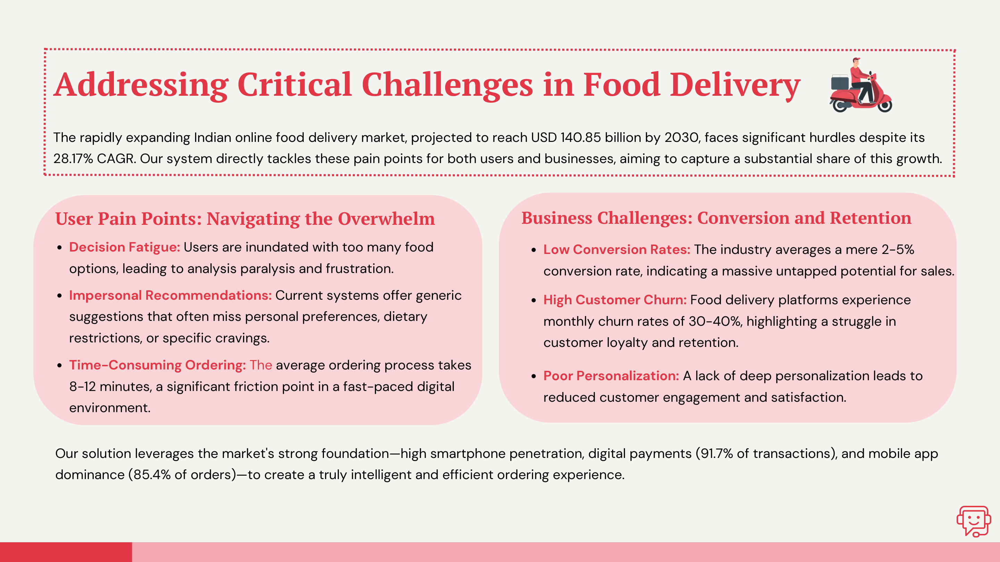
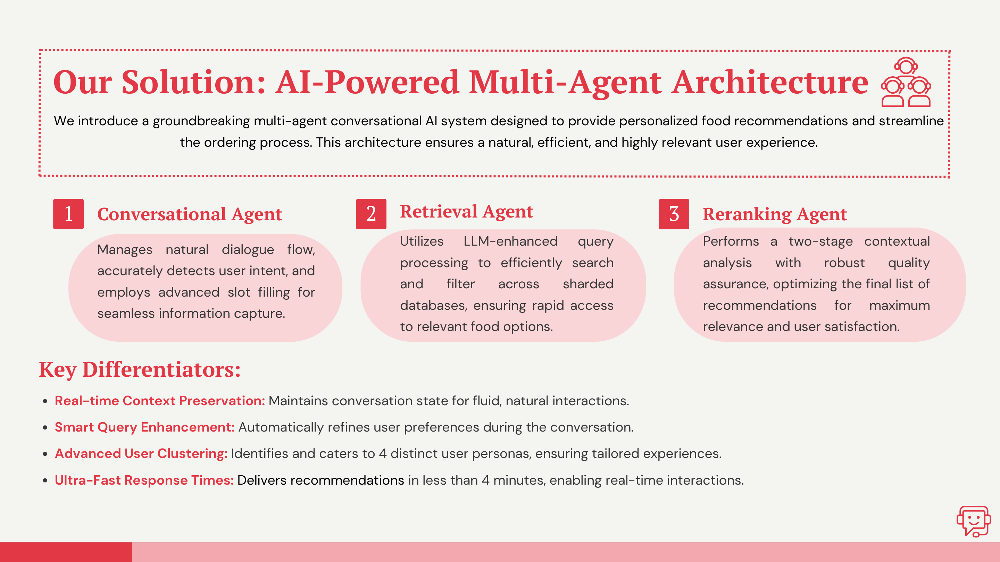
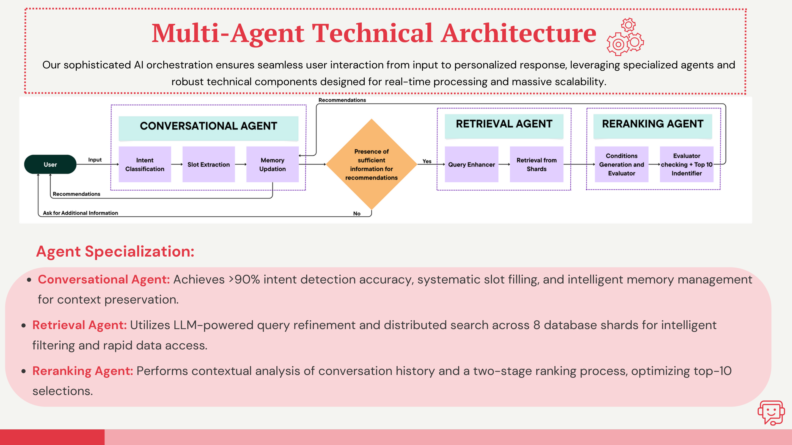
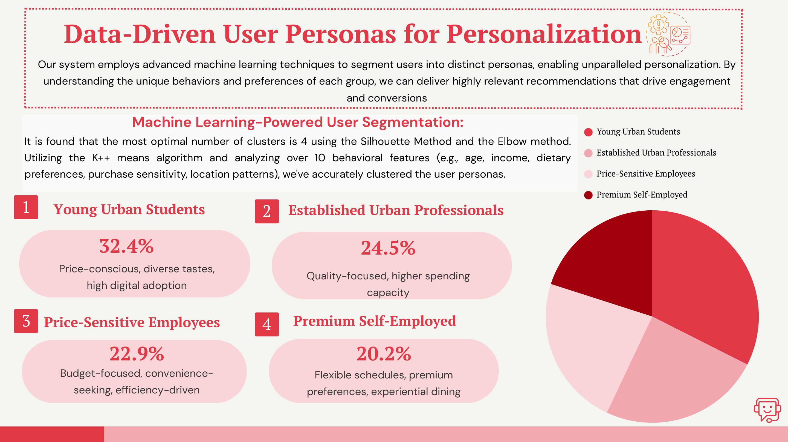
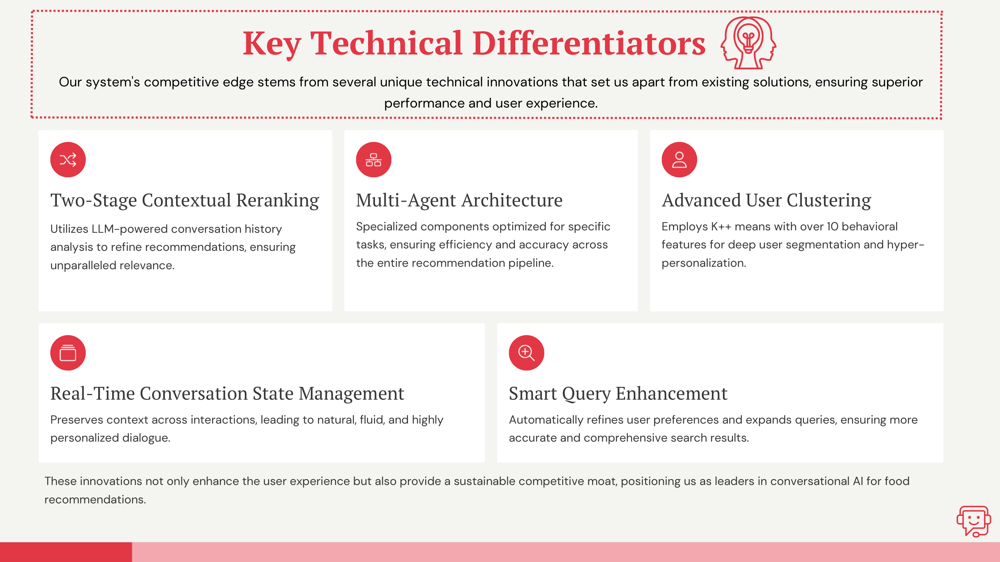

# 🍽️ AI Food Recommendation Chatbot — Multi-Agent RAG System

**A production-grade conversational AI system that delivers personalized food recommendations through multi-agent orchestration, sharded vector retrieval, and two-stage contextual reranking — built on OpenAI + ChromaDB + Gradio.**

> 3 specialized agents · 8 ChromaDB shards · GPT-4o-mini reranker · 4 user personas via K++ clustering · Gradio frontend · Sub-4-minute end-to-end response

---

## 📌 Table of Contents

- [Project Overview](#-project-overview)
- [Market Context & Problem](#-market-context--problem)
- [System Architecture](#-system-architecture)
- [Technical Pipeline](#-technical-pipeline)
- [User Persona Clustering](#-user-persona-clustering)
- [Key Technical Differentiators](#-key-technical-differentiators)
- [Repository Structure](#-repository-structure)
- [How to Run](#-how-to-run)
- [API Key Setup](#-api-key-setup)
- [Data Sources](#-data-sources)
- [Demo](#-demo)
- [Dependencies](#-dependencies)

---

## 📖 Project Overview

This system solves a real gap in food delivery platforms: existing recommenders are either rule-based (rigid, generic) or monolithic LLM assistants (slow, imprecise retrieval). This project builds a **modular multi-agent architecture** that combines the conversational fluency of LLMs with the speed and precision of sharded semantic search.

**The three-agent pipeline:**
- **Conversational Agent** — detects intent, extracts slots (dietary, cuisine, price, dish), and manages multi-turn memory
- **Retrieval Agent** — enhances queries via LLM and runs parallel semantic search across 8 ChromaDB shards
- **Reranking Agent** — performs two-stage contextual reranking using GPT-4o-mini, with explainable condition generation and QA validation

The system was developed and validated as part of a full case study on the Indian online food delivery market.

---

## 📊 Market Context & Problem



**The Indian online food delivery market** is projected to reach **USD 140.85 billion by 2030** (28.17% CAGR). Despite this scale, existing platforms face:

- **2–5% conversion rates** — the industry average, indicating massive untapped potential
- **30–40% monthly churn** — driven by poor personalization and irrelevant suggestions
- **8–12 minute average ordering time** — a critical friction point in a fast-paced mobile-first market

This system directly addresses these pain points through intelligent, real-time, hyper-personalized recommendations.

---

## 🏗️ System Architecture



The system is composed of three specialized agents, each optimized for a specific task:

### 1. Conversational Agent (`conversation_agent.py`)
- **Intent Classification** — LLM-based detection of 7 intent types (recommend, filter_update, clarification, feedback, greeting, goodbye, other) with pattern-matching fallback
- **Slot Extraction** — Structured extraction of dietary preference, cuisine (primary + secondary), dish name, and price range via prompt engineering (`slot_extract.py`)
- **Memory Management** — Stateful multi-turn context tracking across the full session (`memory.py`)
- **Sufficiency Check** — Gates retrieval: if slots are insufficient, the agent generates targeted follow-up questions

### 2. Retrieval Agent (`shards_retrieval.py`, `query_enhancer.py`)
- **Query Enhancement** — LLM converts structured slots into optimized semantic queries + ChromaDB metadata filters
- **Sharded Retrieval** — Parallel semantic search across 8 distributed ChromaDB shards using `sentence-transformers/all-MiniLM-L6-v2` embeddings
- **Top-K per Shard** — Configurable `top_k_per_shard = 5`, yielding a candidate set of up to 40 items per query

### 3. Reranking Agent (`rerank.py`, `rerank_prompts.py`)
- **Stage 1 — Condition Generation:** GPT-4o-mini analyses the user's conversation history and generates context-sensitive ranking rules
- **Stage 2 — Evaluation & QA:** Items are scored against the generated conditions; a QA pass validates the final top-10 selections
- **Explainability:** Every recommendation comes with a plain-English rationale grounded in the user's session context

---

## ⚙️ Technical Pipeline



```
User Input
    │
    ▼
Conversational Agent
    ├── Intent Classification (LLM + fallback patterns)
    ├── Slot Extraction (dietary / cuisine / dish / price)
    ├── Memory Update (multi-turn state)
    └── Sufficiency Check ──► Ask follow-up if incomplete
                │
                ▼ (when slots are sufficient)
Retrieval Agent
    ├── Query Enhancement (LLM → semantic query + filters)
    └── Sharded Retrieval (8 × ChromaDB shards, parallel)
                │
                ▼
Reranking Agent
    ├── Stage 1: Condition Generation (GPT-4o-mini)
    ├── Stage 2: Evaluation + QA
    └── Top-10 with Explainable Reasoning
                │
                ▼
Gradio Frontend → User
```

**Key configuration** (`application/config.yaml`):
```yaml
rerank_model: "gpt-4o-mini"
top_k_per_shard: 5
shard_info_path: "./shard_data/shard_paths.txt"
```

**Detailed agent workflow diagram:**


**Agent performance metrics:**
- Intent detection accuracy: **>90%**
- Database shards: **8** (distributed ChromaDB)
- End-to-end response time: **< 4 minutes**
- Embedding model: `sentence-transformers/all-MiniLM-L6-v2`

---

## 👥 User Persona Clustering



Users are segmented into **4 distinct personas** using the **K++ Means algorithm** trained on 10+ behavioral features (age, income, dietary preferences, purchase sensitivity, location patterns, cuisine affinity). Cluster count was validated using the **Silhouette Method and Elbow Method**.

| Persona | Share | Profile |
|---|---|---|
| Young Urban Students | **32.4%** | Price-conscious, diverse tastes, high digital adoption |
| Established Urban Professionals | **24.5%** | Quality-focused, higher spending capacity |
| Price-Sensitive Employees | **22.9%** | Budget-focused, convenience-seeking, efficiency-driven |
| Premium Self-Employed | **20.2%** | Flexible schedules, premium preferences, experiential dining |

Each cluster informs the reranking agent's condition generation, ensuring recommendations align not just with stated preferences but with behavioural patterns.

---

## 🔬 Key Technical Differentiators



| Differentiator | Implementation |
|---|---|
| **Two-Stage Contextual Reranking** | LLM analyses full conversation history before generating ranking conditions — not just the last message |
| **Multi-Agent Architecture** | Three specialized agents (Conversational, Retrieval, Reranking) each optimized for their specific task |
| **Advanced User Clustering** | K++ means on 10+ behavioral features; 4 distinct personas for hyper-personalization |
| **Real-Time Conversation State** | Full slot and intent state preserved across all turns via `ConversationMemory` |
| **Smart Query Enhancement** | LLM rewrites slot data into semantic queries + structured ChromaDB filters for higher retrieval precision |
| **Sharded Vector DB** | 8 ChromaDB shards enable fast parallel retrieval without a monolithic index bottleneck |

---

## 📁 Repository Structure

```
AI_Food_Recommendation_Chatbot/
│
├── Python Files/                          # Core agent modules
│   ├── orchestrator.py                    # Ties all agents together; manages config and workflow
│   ├── conversation_agent.py              # Intent, slot filling, memory, sufficiency check
│   ├── intent_classifier.py              # LLM + fallback pattern-based intent classification
│   ├── slot_extract.py                    # Structured slot extraction from user input
│   ├── memory.py                          # Conversation state and multi-turn memory
│   ├── response_generator.py             # User-facing response and follow-up generation
│   ├── query_enhancer.py                 # LLM-based semantic query and filter builder
│   ├── shards_retrieval.py               # Parallel semantic search across ChromaDB shards
│   ├── embeddings.py                      # Embedding model setup (all-MiniLM-L6-v2)
│   ├── rerank.py                          # Two-stage contextual reranking logic
│   ├── rerank_prompts.py                 # Prompt templates for condition generation and QA
│   └── utils.py                           # Enums, config constants, API key loader
│
├── application/
│   ├── app.py                             # Gradio frontend — connects to orchestrator
│   ├── config.yaml                        # Model config (rerank model, shard paths, top-k)
│   └── req.txt                            # Full pinned dependency list
│
├── User_clustering_files/
│   ├── User_Clustering_agent.ipynb       # K++ means training, Silhouette/Elbow validation
│   └── ...
│
├── data cleaning and feature engineering/
│   ├── derived_feature_engineering.ipynb # Behavioral feature engineering (ratios, tiers)
│   ├── 2-cuisines.ipynb                   # Cuisine feature merging and exploration
│   └── zomato_restaurant_data_cleaning.ipynb  # Data cleaning, deduplication, joins
│
├── embedding and shards creation/
│   └── shards_creation.ipynb             # Embedding generation and ChromaDB shard build
│
├── images/                                # Case study visuals for this README
├── demo_final_compressed.mp4             # Full end-to-end demo (2 scenarios)
├── case_presentation.pdf                  # Case study presentation
├── Report.pdf                             # Detailed technical report
├── requirements.txt                       # Key dependencies (root level)
└── README.md
```

---

## 🚀 How to Run

### Prerequisites
- Python 3.10+
- OpenAI API key (see [API Key Setup](#-api-key-setup))
- ChromaDB shards downloaded from Google Drive (link below)

### Steps

1. **Clone the repository:**
   ```bash
   git clone https://github.com/aguru-venkata-saisantosh-patnaik/AI_Food_Recommendation_Chatbot-Multi_Agent_RAG_System.git
   cd AI_Food_Recommendation_Chatbot-Multi_Agent_RAG_System
   ```

2. **Install dependencies:**
   ```bash
   pip install -r requirements.txt
   ```

3. **Download the pre-built ChromaDB shards** from Google Drive and place them at the path specified in `application/config.yaml`:
   > [Download Shards (Google Drive)](https://drive.google.com/drive/folders/1yYOu3G_TZ9srSL8hK5-hdkgP7m9wUXic?usp=sharing)

   After downloading, update `application/config.yaml` if needed:
   ```yaml
   shard_info_path: "./shard_data/shard_paths.txt"
   ```

4. **Set your OpenAI API key** — see [API Key Setup](#-api-key-setup) below.

5. **Launch the app:**
   ```bash
   cd application
   python app.py
   ```

6. The Gradio interface will open in your browser. Start with a natural language query like:
   - *"Show me spicy veg biryani under ₹300"*
   - *"I want something non-veg, South Indian, budget around ₹250"*

> **Note:** Full execution (first response) takes under 4 minutes. Subsequent turns in the same session are faster due to cached memory and embeddings.

---

## 🔑 API Key Setup

This project uses the **OpenAI API** for the conversational agent, query enhancer, and reranker (GPT-4o-mini).

1. Get an API key at [platform.openai.com](https://platform.openai.com)
2. Create a `.env` file in the `Python Files/` directory:
   ```
   OPENAI_API_KEY=your_api_key_here
   ```
3. The system loads it automatically via `python-dotenv` in `utils.py`.

---

## 📦 Data Sources

| Dataset | Source | Usage |
|---|---|---|
| Food Recommendation CSV | [Kaggle — schemersays](https://www.kaggle.com/datasets/schemersays/food-recommendation-system) | Food item catalogue and user preference data |
| Zomato Restaurants Dataset | [Kaggle — bharathdevanaboina](https://www.kaggle.com/datasets/bharathdevanaboina/zomato-restaurants-dataset/data) | Restaurant metadata, cuisines, pricing |
| Zomato Database | [Kaggle — anas123siddiqui](https://www.kaggle.com/datasets/anas123siddiqui/zomato-database) | Extended restaurant and menu data |

All datasets were cleaned, deduplicated, feature-engineered, embedded, and sharded before use. The pre-built shards are available via the Google Drive link above.

---

## 🎬 Demo

A full end-to-end demo video (`demo_final_compressed.mp4`) is included in the repository, showcasing **2 complete user scenarios** — from initial greeting through multi-turn slot filling to final ranked recommendations.

[▶ Watch Demo on GitHub](demo_final_compressed.mp4)

---

## 📦 Dependencies

Key packages:

```
openai                    # GPT-4o-mini for conversational agent and reranker
chromadb                  # Sharded vector database for semantic retrieval
langchain-chroma          # LangChain-ChromaDB integration
langchain-huggingface     # HuggingFace embeddings via LangChain
sentence-transformers     # all-MiniLM-L6-v2 embedding model
gradio                    # Web frontend
scikit-learn              # K++ means user clustering
pandas / numpy            # Data processing
pyyaml                    # Config file management
python-dotenv             # API key loading from .env
psutil                    # Memory monitoring for embedding setup
torch / transformers      # Model inference backend
```

Full pinned dependency list: [`application/req.txt`](application/req.txt)

---

*A multi-agent AI system built from first principles — modular, explainable, and grounded in real food delivery market dynamics.*
